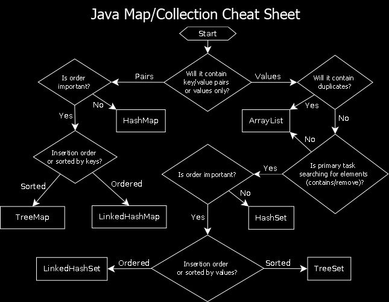

- [Question asked in interview](../../asked_in_Interview_coding_java.md)
- [Useful code snippets for interview](../../src/MostUsedJavaSnippetsForInterview.java)

#  1. 👀 Code  Visualization ( visualize the code)
- [Algo-lens](https://jaroslaw-weber.github.io/algo-lens/list/all)

# 2. 🗺️ Roadmaps & Sheets

## 2.1 Roadmaps Grouped by data stucture and algorithm
- [NeetCode Question with Roadmap](https://neetcode.io/roadmap)
- [Grind 75 questions](https://www.techinterviewhandbook.org/grind75/?mode=preferences&order=topics&grouping=topics)
- [LeetCode 75 with Hints](https://docs.google.com/spreadsheets/d/1A2PaQKcdwO_lwxz9bAnxXnIQayCouZP6d-ENrBz_NXc/edit?gid=0#gid=0)
- [Leetcode 100 DSA Interview Questions](https://leetcode.com/discuss/interview-question/4258631/Top-100-DSA-Interview-Questions)
- [150 coding question](150_coding_question.pdf)

## 2.2 Others Roadmaps
- [Strivers RoadMap](https://takeuforward.org/strivers-a2z-dsa-course/strivers-a2z-dsa-course-sheet-2)
---

# Master cheatsheet

## Coding Patterns

### Useful articles
- [20 Patterns to Master Dynamic Programming](https://blog.algomaster.io/p/20-patterns-to-master-dynamic-programming?utm_source=share&utm_medium=android&r=2lbd1v&triedRedirect=true)

### Other resources
- [ Coding pattern ](coding_patten.md)
- [ Recursion Patterns](recursion_patterns.md)
