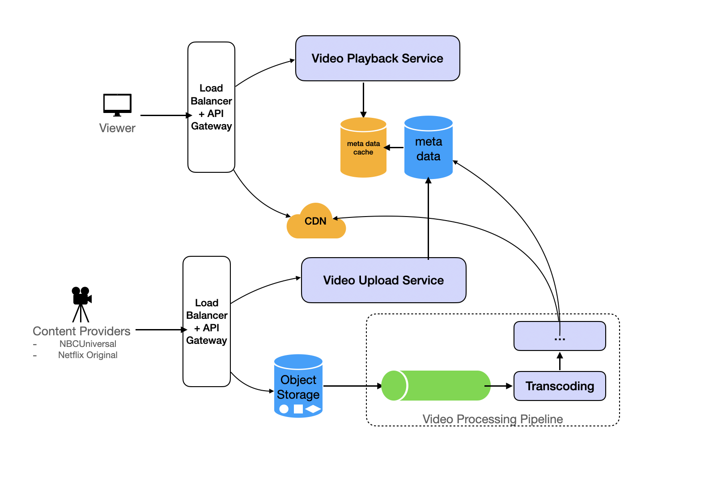

# Netflix

The key components in the high-level architecture for video streaming include the following:

API Gateway: The entry point for all client requests, directing to appropriate services.
Video Playback Service: Manages video streaming logic and directs requests to video storage or CDN.
Object Storage: Stores the actual video files.
CDN (Content Delivery Network): Distributes video content to users to minimize latency.
Read Path: When a user initiates a request to view a video, this request is processed by the load balancer and API
Gateway, which then routes it to the Video Playback Service. This service efficiently retrieves video data through
caching layers optimized for quick access, before accessing the Video Metadata Storage for the video's URL. Once
retrieved, the video is streamed from the nearest CDN node to the user's device, ensuring a seamless playback
experience.

The Content Delivery Network (CDN) is crucial for delivering cached videos from a location nearest to the user,
significantly reducing latency and enhancing the viewing experience.
The metadata database is responsible for managing video titles, descriptions, and user interactions such as likes and
comments. These databases are optimized to support high volumes of read operations efficiently.

API Design
GET /videos - Retrieves a list of videos.
POST /videos - Uploads a new video.
GET /videos/{videoId}/play - coding.StreamsExampleUsage a video.
POST /users/{userId}/history - Updates user's viewing history.

► Read-Heavy Systems 
These focus on scale, latency, and efficient data fetching. 
1. Design a URL Shortener (Bitly) 
 → Talk about key generation, collisions, and DB storage. 
 → Add caching and DB sharding if traffic is high.

2. Design an Image Hosting Service 
 → Talk about object storage (S3, GCS) + CDN usage. 
 → Consider image deduplication and resizing strategies.

3. Design a Social Media Platform (Twitter/Facebook) 
 → Talk about posts, timelines, relationships (follows, friends). 
 → Focus on denormalized storage and sharding.

4. Design a NewsFeed System (Hard) 
 → Push vs Pull models, Fanout on Write vs Read. 
 → Caching, pagination, and ranking algorithms.

► Write-Heavy Systems 
Here, durability, throughput, and ingestion speed are critical.

5. Design a Rate Limiter 
 → Token bucket or leaky bucket algorithms. 
 → Redis-backed counters + TTL logic.

6. Design a Log Collection and Analysis System 
 → Use Kafka for ingestion, and something like ELK for processing. 
 → Talk about partitioning, buffering, and real-time querying.

7. Design a Voting System 
 → Idempotency, fraud prevention, and result aggregation. 
 → Real-time vs eventual vote count updates.

8. Design a Trending Topics System 
 → Use count-min sketch or approximate counting. 
 → Talk about sliding window aggregation + ranking.

► Strong Consistency Systems 
Transactional integrity and failure handling become the focus.

9. Design an Online Ticket Booking System 
 → Handle race conditions with locking or optimistic concurrency. 
 → Talk about seat reservation + payment flow.

10. Design an E-Commerce Website (Amazon) 
 → Cover product catalog, cart service, order processing. 
 → Include DB consistency, checkout idempotency.

11. Design an Online Messaging App (WhatsApp/Slack) 
 → Talk about message queues, delivery receipts, retries. 
 → Offline storage, notification delivery, scaling chat infra.

12. Design a Task Management Tool 
 → CRUD APIs, user auth, task assignment. 
 → Background jobs, status updates, and audit trails.

► Scheduler Services 
Timing, reliability, and eventual execution are tested here.

13. Design a Web Crawler 
 → BFS vs DFS for crawling, politeness rules. 
 → Distributed queues, duplicate URL filters.

14. Design a Task Scheduler 
 → Job queues, retry logic, cron-based triggers. 
 → Priority queues and task deduplication.

15. Design a Real-Time Notification System 
 → Push vs Polling, webhooks, and device token mgmt. 
 → Scale delivery across millions of users.

 ► Trie / Proximity Systems 
Efficient data structures and latency-optimized retrieval.

16. Design a Search Autocomplete System 
 → Trie or Ternary Search Tree backed by frequency rank. 
 → Debouncing, caching, and typo-tolerance.

17. Design a Ride-Sharing App (Uber/Lyft) 
 → Matchmaking engine, real-time location tracking. 
 → Talk about ETA algorithms, surge pricing, DB design.