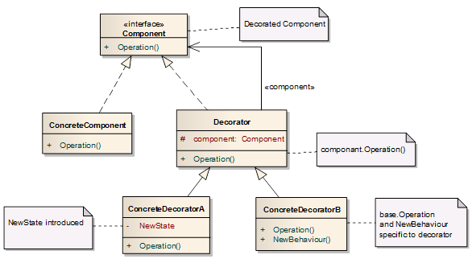
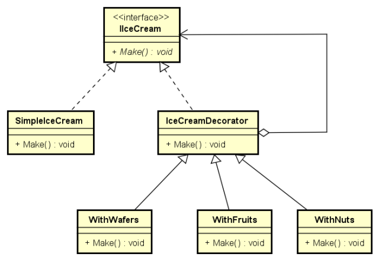
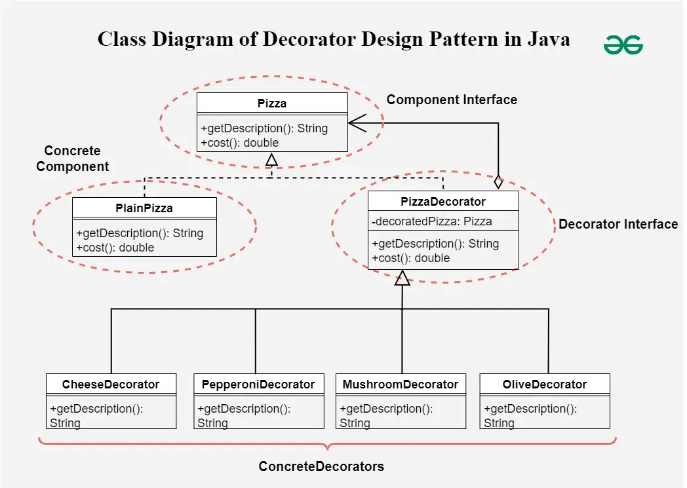

> TO MAIN PAGE  - [ Back to main page ](README.md)

# Summary from Shrayansh Jain  :

-  All Behavioral Patterns  : https://notebook.zohopublic.in/public/notes/bietvc07e6ecf28d7409286145c16e623f9ed
-  All Structural Design Patterns : https://notebook.zohopublic.in/public/notes/74tdo33c5b7060d544b1c986e519dd3ba4d1b


# 🎨 Design Patterns for SDE-2 Interviews

## 📚 Table of Contents

## Table of Contents

### 1. [Creational Patterns](#creational-patterns)
- Creational design patterns deal with object creation mechanisms, trying to create objects in a manner suitable to the situation.
- Important ones to focus on:
    - [Singleton Pattern](#design-pattern-singleton)
    - [Factory Pattern](#factory-pattern--object-creation-without-exposing-logic)
    - [Abstract Factory Pattern](#abstract-factory-pattern)
    - [Builder Pattern](#builder-pattern)
- Others:
    - [Prototype Pattern](#prototype-pattern--clone-existing-objects-instead-of-building-anew)


### 2. [Structural Patterns](#structural-patterns)
- Structural design pattern is a way to `combine or arrange classes` and objects to form `bigger structures` while keeping them flexible and efficient.

- Important ones to focus on:
    - [Decorator Pattern](#decorator-pattern)
    - [Proxy Pattern](#proxy-pattern)
- Others:
    - [Adapter Pattern](#adapter-pattern)
    - [Bridge Pattern](#bridge-pattern)
    - [Composite Pattern](#composite-pattern)
    - [Facade Pattern](#facade-pattern)
    - [Flyweight Pattern](#flyweight-pattern)

### 3. [Behavioral Patterns](#behavioral-patterns-continued)
- Important ones to focus on:
    - [Strategy Pattern](#strategy-pattern)
    - [Observer Pattern](#observer-pattern)
    - [Chain of Responsibility Pattern](#%EF%B8%8F-chain-of-responsibility-pattern)
- Others:    
    - [Command Pattern](#command-pattern)
    - [Interpreter Pattern](#interpreter-pattern)
    - [Iterator Pattern](#iterator-pattern)
    - [Mediator Pattern](#mediator-pattern)
    - [Memento Pattern](#memento-pattern)
    - [State Pattern](#state-pattern)
    - [Template Method Pattern](#template-method-pattern)
    - [Visitor Pattern](#visitor-pattern)


---

# 🏗️ Creational Patterns

These patterns deal with object creation mechanisms. For SDE-2 interviews, focus on:
- Thread safety considerations
- Performance implications
- Scaling aspects

## 🎯 Design Pattern: Singleton

### 🔐 Intent
Ensure a class has only one instance and provide a global point of access to it.

### 🧠 Real-World Analogies
- **Logger** → All classes write to one logger.
- **Database Connection Pool** → Only one pool managing DB connections.
- **Print Spooler** → Prevent conflicts from multiple instances printing.

---

## ✅ Common Interview Questions (with examples)

### 1. Eager Initialization
```java
public class EagerSingleton {
    private static final EagerSingleton instance = new EagerSingleton();  // Eager

    private EagerSingleton() {}

    public static EagerSingleton getInstance() {
        return instance;
    }
}
```
**Pros:**
- Thread-safe (JVM loads static fields thread-safely)
- Simple

**Cons:**
- Instance created even if not used (wastes memory)

> Interview Tip: “Great for lightweight singletons. I avoid it when the object is resource-heavy, like a DB pool.”

---

### 2. Lazy Initialization (Non-thread-safe ❌)
```java
public class LazySingleton {
    private static LazySingleton instance;

    private LazySingleton() {}

    public static LazySingleton getInstance() {
        if (instance == null) {
            instance = new LazySingleton();  // ❌ Not thread-safe
        }
        return instance;
    }
}
```
> Avoid this version in multi-threaded environments unless synchronized.

---

### 3. Thread-Safe Lazy Initialization (Synchronized method)
```java
public class ThreadSafeSingleton {
    private static ThreadSafeSingleton instance;

    private ThreadSafeSingleton() {}

    public static synchronized ThreadSafeSingleton getInstance() {
        if (instance == null) {
            instance = new ThreadSafeSingleton();
        }
        return instance;
    }
}
```
**Pros:**
- Thread-safe

**Cons:**
- Performance hit due to method-level synchronization

---

### 4. Double-Checked Locking (Best Lazy Thread-safe)
```java
public class DCLSingleton {
    private static volatile DCLSingleton instance;

    private DCLSingleton() {}

    public static DCLSingleton getInstance() {
        if (instance == null) {
            synchronized (DCLSingleton.class) {
                if (instance == null) {
                    instance = new DCLSingleton();  // Safe + Fast
                }
            }
        }
        return instance;
    }
}
```
**Why `volatile`?**
> Without it, threads may see a half-constructed object due to instruction reordering.

---

### 5. Bill Pugh Singleton (Best + Lazy + Clean)
```java
public class BillPughSingleton {
    private BillPughSingleton() {}

    private static class SingletonHelper {
        private static final BillPughSingleton INSTANCE = new BillPughSingleton();
    }

    public static BillPughSingleton getInstance() {
        return SingletonHelper.INSTANCE;
    }
}
```
- Uses JVM's class loader to ensure thread-safe lazy init without sync block.

> “This is my favorite — lazy, thread-safe, no locks.”

---

## ✅ Real Interview Scenario (Database Example)
```java
public class DatabaseConnection {
    private static volatile DatabaseConnection instance;

    private DatabaseConnection() {
        System.out.println("Connected to DB");
    }

    public static DatabaseConnection getInstance() {
        if (instance == null) {
            synchronized (DatabaseConnection.class) {
                if (instance == null) {
                    instance = new DatabaseConnection();
                }
            }
        }
        return instance;
    }

    public void query(String sql) {
        System.out.println("Executing: " + sql);
    }
}
```

### ✅ Usage
```java
public class Main {
    public static void main(String[] args) {
        DatabaseConnection db = DatabaseConnection.getInstance();
        db.query("SELECT * FROM users");
    }
}
```

---

## 🧠 What Interviewers Might Ask

| Question              | What to Explain                                                      |
|-----------------------|---------------------------------------------------------------------|
| Why Singleton?        | One shared resource — like DB, logger, config manager                |
| Is it thread-safe?    | Only some versions — use synchronized, volatile, or inner class      |
| Which is best?        | For interviews: Bill Pugh or Double-Checked Locking                  |
| Where is it used?     | DB connection pool, config manager, cache, logger, scheduler         |
| Why not static methods?| Static methods break OOP: no inheritance, no interface, no mocking in tests |

---

## ✅ Ready-to-use Interview Lines
> I’ve implemented Singleton for a DB connection manager using double-checked locking. I also use the Bill Pugh method when I want lazy, thread-safe instantiation without locking overhead.


---

## 🏭 Factory Pattern — Object Creation Without Exposing Logic

## ✅ Intent
Define an interface for creating an object, but let subclasses decide which class to instantiate.

## 💡 Real-Life Analogy
Imagine a Vehicle Factory:
- You ask for a "vehicle" and get a Car or Bike depending on input
- You don't need to know how it's made

## 🎯 Use Case in Interviews
- Create different types of objects based on input
- Decouple object creation from business logic
- Common in frameworks (Spring beans, JDBC drivers, etc.)

## ✅ Java Interview Example: Notification System

### 📦 Step 1: Common Interface
```java
public interface Notification {
    void notifyUser();
}
```

### 🚗 Step 2: Concrete Implementations
```java
public class SMSNotification implements Notification {
    public void notifyUser() {
        System.out.println("Sending SMS Notification");
    }
}

public class EmailNotification implements Notification {
    public void notifyUser() {
        System.out.println("Sending Email Notification");
    }
}

public class PushNotification implements Notification {
    public void notifyUser() {
        System.out.println("Sending Push Notification");
    }
}
```

### 🏭 Step 3: Factory Class
```java
public class NotificationFactory {
    public static Notification createNotification(String type) {
        if (type == null || type.isEmpty()) return null;
        switch (type.toLowerCase()) {
            case "sms":
                return new SMSNotification();
            case "email":
                return new EmailNotification();
            case "push":
                return new PushNotification();
            default:
                throw new IllegalArgumentException("Unknown notification type: " + type);
        }
    }
}
```

### 🚀 Step 4: Usage in Client Code
```java
public class Main {
    public static void main(String[] args) {
        Notification notification = NotificationFactory.createNotification("email");
        notification.notifyUser();
    }
}
```

## 🎤 What to Say in an Interview
> I used the Factory pattern to decouple notification creation. Based on input, the factory returns the appropriate notification object. This makes it easy to add new types later — like Slack or WhatsApp — without changing the client code.

## 🔍 Interview Questions & Answers

| Question | What to Answer |
|----------|----------------|
| Why Factory? | To delegate object creation and support open/closed principle |
| When to use it? | When you have many related classes and want to decouple their creation |
| Real-world usage? | Spring's ApplicationContext.getBean(), JDBC DriverManager.getConnection() |
| Pros? | Loose coupling, easy to extend, centralized object creation |
| How is it different from Abstract Factory? | Factory → one product; Abstract Factory → families of products |

## ✅ Summary

| Aspect | Factory Pattern |
|--------|----------------|
| Type | Creational |
| Focus | Decouple creation logic |
| Useful For | Replacing new with centralized creation |
| Interview Tip | Use real-world service examples like Notification, DB Connection, Payment, etc. |

---

## 🏭 Abstract Factory Pattern

## ✅ Intent
Provide an interface for creating families of related or dependent objects without specifying their concrete classes.

## 💡 Real-Life Analogy
Think of a furniture factory that creates related products (Chair + Table + Sofa):
- Modern Furniture Factory → Creates Modern Chair + Modern Table + Modern Sofa
- Victorian Furniture Factory → Creates Victorian Chair + Victorian Table + Victorian Sofa

## 🎯 SDE-2 Interview Scenario: Cross-Platform UI Components

### 📦 Step 1: Abstract Products
```java
// Button interface
public interface Button {
    void render();
    void onClick();
}

// Checkbox interface
public interface Checkbox {
    void render();
    void toggle();
}
```

### 🏭 Step 2: Concrete Products
```java
// MacOS Products
public class MacButton implements Button {
    @Override
    public void render() {
        System.out.println("Rendering MacOS button");
    }

    @Override
    public void onClick() {
        System.out.println("MacOS button clicked");
    }
}

public class MacCheckbox implements Checkbox {
    @Override
    public void render() {
        System.out.println("Rendering MacOS checkbox");
    }

    @Override
    public void toggle() {
        System.out.println("MacOS checkbox toggled");
    }
}

// Windows Products
public class WindowsButton implements Button {
    @Override
    public void render() {
        System.out.println("Rendering Windows button");
    }

    @Override
    public void onClick() {
        System.out.println("Windows button clicked");
    }
}

public class WindowsCheckbox implements Checkbox {
    @Override
    public void render() {
        System.out.println("Rendering Windows checkbox");
    }

    @Override
    public void toggle() {
        System.out.println("Windows checkbox toggled");
    }
}
```

### 🎨 Step 3: Abstract Factory
```java
public interface GUIFactory {
    Button createButton();
    Checkbox createCheckbox();
}
```

### 🏢 Step 4: Concrete Factories
```java
public class MacFactory implements GUIFactory {
    @Override
    public Button createButton() {
        return new MacButton();
    }

    @Override
    public Checkbox createCheckbox() {
        return new MacCheckbox();
    }
}

public class WindowsFactory implements GUIFactory {
    @Override
    public Button createButton() {
        return new WindowsButton();
    }

    @Override
    public Checkbox createCheckbox() {
        return new WindowsCheckbox();
    }
}
```

### 🚀 Step 5: Client Code
```java
public class Application {
    private Button button;
    private Checkbox checkbox;

    public Application(GUIFactory factory) {
        button = factory.createButton();
        checkbox = factory.createCheckbox();
    }

    public void createUI() {
        button.render();
        checkbox.render();
    }

    public static void main(String[] args) {
        // Create MacOS UI
        Application mac = new Application(new MacFactory());
        mac.createUI();

        // Create Windows UI
        Application windows = new Application(new WindowsFactory());
        windows.createUI();
    }
}
```

## 🎤 What to Say in an Interview
> "I used Abstract Factory when I needed to ensure that created objects work together consistently. For example, in a cross-platform UI toolkit, it ensures we don't mix MacOS and Windows components. The pattern helped maintain consistency and made the system easily extensible for new platforms."

## 🔍 SDE-2 Level Interview Questions

| Question | Answer |
|----------|---------|
| How does Abstract Factory differ from Factory Method? | Abstract Factory creates families of related objects, while Factory Method creates a single type of object |
| How would you handle a new platform requirement? | Add new concrete products and a new concrete factory without modifying existing code (Open/Closed Principle) |
| Thread safety considerations? | Factories are typically stateless, making them naturally thread-safe. If they maintain state, use synchronization or make them immutable |
| Performance implications? | Minimal overhead as factories are typically lightweight. Can implement caching if object creation is expensive |
| Real-world examples? | UI toolkits (SWT/Swing), Database connections for different vendors, Cloud service providers' APIs |

## ✅ Design Considerations for Scale

| Aspect | Consideration |
|--------|---------------|
| Extensibility | New product families can be added without changing existing code |
| Consistency | Ensures related objects work together properly |
| Complexity | Can become complex with many product variants |
| Testing | Easy to mock with different factory implementations |
| Maintenance | Centralized point for creating related objects |

## 💡 Pro Tips for SDE-2 Interviews
1. Mention how you've used it in microservices (e.g., creating different client implementations)
2. Discuss how it helps with dependency injection and testing
3. Talk about how it supports the Interface Segregation Principle
4. Explain its role in maintaining system consistency at scale

---

## 🏗️ Builder Pattern

**Intent:**
Separate the construction of a complex object from its representation so the same construction process can create different representations.

**Real-Life Analogy:**
Think of ordering a custom burger 🍔.
You say: "Add cheese, no onion, double patty", and the chef builds it step by step — you don’t build it directly.

---

### Java Example: User Object Builder

#### 1. User Class with Builder
```java
public class User {
    // Required fields
    private final String name;
    private final String email;

    // Optional fields
    private final int age;
    private final String address;

    // Private constructor, only accessible via Builder
    private User(UserBuilder builder) {
        this.name = builder.name;
        this.email = builder.email;
        this.age = builder.age;
        this.address = builder.address;
    }

    // Getters (optional)
    public String getName() { return name; }
    public String getEmail() { return email; }
    public int getAge() { return age; }
    public String getAddress() { return address; }

    @Override
    public String toString() {
        return name + " | " + email + " | " + age + " | " + address;
    }

    // Static inner Builder class
    public static class UserBuilder {
        // Required
        private final String name;
        private final String email;

        // Optional
        private int age;
        private String address;

        public UserBuilder(String name, String email) {
            this.name = name;
            this.email = email;
        }

        public UserBuilder setAge(int age) {
            this.age = age;
            return this;
        }

        public UserBuilder setAddress(String address) {
            this.address = address;
            return this;
        }

        public User build() {
            return new User(this);
        }
    }
}
```

#### 2. Client Code
```java
public class Main {
    public static void main(String[] args) {
        User user = new User.UserBuilder("Satish", "satish@example.com")
                            .setAge(30)
                            .setAddress("Bangalore")
                            .build();

        System.out.println(user);
    }
}
```

**Sample Output:**
```
Satish | satish@example.com | 30 | Bangalore
```

---

### Interview Tips
- **What to say:**
  > "I used the Builder Pattern to construct complex objects like User or RequestDTO where many optional fields exist. It improves code readability, prevents constructor explosion, and supports immutability by keeping fields final."

- **Real-World Examples:**
  - `StringBuilder.append()`
  - Lombok `@Builder`
  - Spring `MockMvcRequestBuilders`
  - Complex object creation in APIs and DSLs

- **Common Interview Questions:**
  | Question | Answer |
  |---|---|
  | When to use Builder? | When an object has many optional fields or steps |
  | How is it different from Factory? | Factory abstracts creation logic; Builder focuses on step-by-step construction |
  | Is Builder thread-safe? | Only if you make it — use local variables or immutable state |
  | Can you enforce required fields? | Yes — pass required fields in the Builder constructor |
  | Alternatives? | Telescoping constructors (bad), setters (not immutable) |

- **Quick Summary:**
  - **Type:** Creational
  - **Purpose:** Build complex objects step by step
  - **Best For:** Objects with many optional params
  - **Interview Tip:** Mention Lombok, APIs, immutability, readability

---

## 🧬 Prototype Pattern — Clone Existing Objects Instead of Building Anew

## ✅ Intent
Create new objects by copying an existing object (prototype), instead of creating from scratch. This is useful when object creation is costly or needs to preserve configuration.

## 💡 Real-Life Analogy
Imagine making a duplicate key 🗝️ — you copy an original key instead of designing a new one from scratch. The copy is almost instant and replicates everything about the original.

## 🎯 Interview Scenario: Cloning a Complex Shape or Configuration
Suppose you have a complex object like a Graph, Configuration Object, or Document Template — instead of re-initializing everything manually, you just clone it.

---

## ✅ Java Implementation

### 🔹 Step 1: Implement Cloneable
```java
public abstract class Document implements Cloneable {
    private String title;
    private String content;

    public Document(String title, String content) {
        this.title = title;
        this.content = content;
    }

    public abstract void print();

    public String getTitle() {
        return title;
    }

    public void setTitle(String title) {
        this.title = title;
    }

    @Override
    public Document clone() {
        try {
            return (Document) super.clone();  // shallow copy
        } catch (CloneNotSupportedException e) {
            throw new AssertionError("Cloning not supported");
        }
    }
}
```

### 🔸 Step 2: Concrete Prototype
```java
public class ResumeDocument extends Document {
    public ResumeDocument(String title, String content) {
        super(title, content);
    }

    @Override
    public void print() {
        System.out.println("Printing Resume: " + getTitle());
    }
}
```

### 🚀 Step 3: Client Code
```java
public class Main {
    public static void main(String[] args) {
        ResumeDocument original = new ResumeDocument("Satish's Resume", "Content...");
        ResumeDocument copy = (ResumeDocument) original.clone();

        copy.setTitle("Copy of Satish's Resume");

        original.print();  // Printing Resume: Satish's Resume
        copy.print();      // Printing Resume: Copy of Satish's Resume
    }
}
```

---

## 🔐 Deep Copy vs Shallow Copy
- `super.clone()` does shallow copy — copies primitives and object references.
- If your object contains mutable objects, override `clone()` to deep copy them manually.

### 🧪 Deep Copy Example (Nested Object)
```java
@Override
public Document clone() {
    try {
        Document clone = (Document) super.clone();
        clone.nestedObject = new NestedObject(this.nestedObject); // Deep copy
        return clone;
    } catch (CloneNotSupportedException e) {
        throw new AssertionError();
    }
}
```

---

## 🎤 What to Say in an Interview
> I used the Prototype Pattern when I had to generate a large number of similar objects quickly — like configurations, resumes, or shapes. Cloning helped avoid repeated initialization and preserved internal structure. For deep copies, I ensured nested objects were also cloned.

---

## 🧪 Real-World Examples
- `Object.clone()` in Java
- Prototyping configuration objects in Spring Boot
- Game character cloning or template documents

---

## ❓ Common Interview Questions

| Question | Answer |
|---|---|
| When is Prototype useful? | When object creation is expensive or needs to retain internal state |
| What’s the difference between shallow and deep copy? | Shallow copies references; deep copies nested objects |
| Any downsides of Object.clone()? | Yes, it throws CloneNotSupportedException, has confusing semantics |
| Alternatives? | Serialization, copy constructors, copy factory methods |
| Can you make Prototype immutable? | Yes, but then cloning doesn’t help much — usually for mutable objects |

---

## ✅ Quick Summary

| Aspect   | Prototype Pattern |
|----------|------------------|
| Type     | Creational       |
| Purpose  | Create object copies |
| Best For | Heavy or preconfigured objects |
| Tip      | Be careful with deep copy and mutable fields |

---

# 🎨 Structural Patterns

## 🎭 Decorator Pattern

- The decorator pattern allows us to add `new functionality to an object` dynamically without
modifying the original code. This is achieved by creating decorator classes that wrap the original object and add new behaviors or attributes

- Decorator is a structural design pattern that lets you `attach new behaviors` to objects `by placing` these objects `inside special wrapper objects` that contain the behaviors.

- `add new functionality to an object` `dynamically without altering its structure`.

### 💡 Real-Life Analogy
Think of customizing a coffee order:
- Start with basic coffee
- Add milk (decorator)
- Add sugar (decorator)
- Add whipped cream (decorator)
Each addition wraps the previous one and adds its own behavior.









### 🔍 SDE-2 Level Interview Questions

| Question | Answer |
|----------|---------|
| How does Decorator differ from Inheritance? | Decorator provides flexible runtime behavior composition vs static inheritance |

---

## 🔌 Adapter Pattern
### ✅ Intent
Allow objects with incompatible interfaces to work together by wrapping an existing class with a new interface.

### 💡 Real-Life Analogy
A power plug adapter lets you plug a US device into a European socket.

### 🎯 SDE2 Interview Scenario: Integrating a legacy payment gateway with a new interface.

#### Java Example
```java
// Target interface
public interface Payment {
    void pay(double amount);
}

// Adaptee (legacy)
public class LegacyPaymentSystem {
    public void makePayment(int amountInCents) {
        System.out.println("Paid " + amountInCents + " cents");
    }
}

// Adapter
public class PaymentAdapter implements Payment {
    private LegacyPaymentSystem legacy;
    public PaymentAdapter(LegacyPaymentSystem legacy) {
        this.legacy = legacy;
    }
    public void pay(double amount) {
        legacy.makePayment((int)(amount * 100));
    }
}
```

#### Interview Q&A
| Question | Answer |
|----------|--------|
| When to use? | When integrating incompatible interfaces |
| Real-world usage? | JDBC, Spring DataSource, API wrappers |
| Pitfalls? | Overuse can lead to messy code; prefer refactoring if possible |

---

## 🌉 Bridge Pattern
### ✅ Intent
Decouple abstraction from implementation so they can vary independently.

### 💡 Real-Life Analogy
TV remote (abstraction) and TV (implementation) can evolve separately.

#### Java Example
```java
// Abstraction
abstract class Remote {
    protected TV implementor;
    public Remote(TV implementor) { this.implementor = implementor; }
    public abstract void on();
}

// Implementation
interface TV {
    void turnOn();
}

class SonyTV implements TV {
    public void turnOn() { System.out.println("Sony TV ON"); }
}

class BasicRemote extends Remote {
    public BasicRemote(TV implementor) { super(implementor); }
    public void on() { implementor.turnOn(); }
}
```

#### Interview Q&A
| Question | Answer |
|----------|--------|
| When to use? | When abstraction and implementation may change independently |
| Real-world usage? | JDBC drivers, UI toolkits |

---

## 🌲 Composite Pattern
### ✅ Intent
Compose objects into tree structures to represent part-whole hierarchies. Treat individual objects and compositions uniformly.

### 💡 Real-Life Analogy
Folders containing files or other folders.

#### Java Example
```java
interface FileSystem {
    void ls();
}
class File implements FileSystem {
    private String name;
    public File(String name) { this.name = name; }
    public void ls() { System.out.println(name); }
}
class Directory implements FileSystem {
    private String name;
    private List<FileSystem> children = new ArrayList<>();
    public Directory(String name) { this.name = name; }
    public void add(FileSystem fs) { children.add(fs); }
    public void ls() {
        System.out.println(name);
        for (FileSystem fs : children) fs.ls();
    }
}
```

#### Interview Q&A
| Question | Answer |
|----------|--------|
| When to use Composite? | When you need to treat individual and group objects uniformly |
| Real-world usage? | UI components, file systems |

---

## 🏛️ Facade Pattern
### ✅ Intent
Provide a simplified interface to a complex subsystem.

### 💡 Real-Life Analogy
A universal remote controls multiple devices with one interface.

#### Java Example
```java
class Computer {
    public void startCPU() { System.out.println("CPU started"); }
    public void startMemory() { System.out.println("Memory started"); }
    public void startHD() { System.out.println("HD started"); }
}
class ComputerFacade {
    private Computer computer = new Computer();
    public void start() {
        computer.startCPU();
        computer.startMemory();
        computer.startHD();
        System.out.println("Computer started");
    }
}
```

#### Interview Q&A
| Question | Answer |
|----------|--------|
| When to use Facade? | To simplify complex subsystems for clients |
| Real-world usage? | Spring's JdbcTemplate, Logging frameworks |

---

## 🪶 Flyweight Pattern
### ✅ Intent
Use sharing to support large numbers of fine-grained objects efficiently.

### 💡 Real-Life Analogy
A text editor shares character objects for each letter instead of creating new ones every time.

#### Java Example
```java
class Character {
    private char value;
    public Character(char value) { this.value = value; }
}
class CharacterFactory {
    private Map<Character, Character> pool = new HashMap<>();
    public Character get(char c) {
        pool.putIfAbsent(c, new Character(c));
        return pool.get(c);
    }
}
```

#### Interview Q&A
| Question | Answer |
|----------|--------|
| When to use Flyweight? | When many objects share common state |
| Real-world usage? | String pool, UI icons, game objects |

---

## 🕵️ Proxy Pattern
### ✅ Intent
Provide a surrogate or placeholder for another object to control access, add security, or reduce cost.

### 💡 Real-Life Analogy
A security guard controls access to a building.

#### Java Example
```java
interface Service {
    void request();
}
class RealService implements Service {
    public void request() { System.out.println("RealService request"); }
}
class ProxyService implements Service {
    private RealService realService;
    public void request() {
        if (realService == null) realService = new RealService();
        System.out.println("Proxy: Checking access");
        realService.request();
    }
}
```

#### Interview Q&A
| Question | Answer |
|----------|--------|
| When to use Proxy? | For access control, lazy loading, logging |
| Real-world usage? | Spring AOP, Hibernate proxies, security wrappers |

---

# 🧠 Behavioral Patterns 

## Observer Pattern
### ✅ Intent
Define a one-to-many dependency between objects so that when one object changes state, all its dependents are notified and updated automatically.

### 💡 Real-Life Analog
- News agency and subscribers: When news is published, all subscribers get notified.
- YouTube channel and subscribers: When a new video is uploaded, all subscribers are notified.


## ⛓️ Chain of Responsibility Pattern
### ✅ Intent
Pass a request along a chain of handlers. Each handler decides either to process the request or to pass it to the next handler in the chain.

### 💡 Real-Life Analogy
Customer support escalation: Level 1 → Level 2 → Level 3.

#### Java Example
```java
abstract class Handler {
    protected Handler next;
    public void setNext(Handler next) { this.next = next; }
    public abstract void handle(String request);
}
class AuthHandler extends Handler {
    public void handle(String request) {
        if (request.equals("auth")) System.out.println("Auth handled");
        else if (next != null) next.handle(request);
    }
}
class LogHandler extends Handler {
    public void handle(String request) {
        if (request.equals("log")) System.out.println("Log handled");
        else if (next != null) next.handle(request);
    }
}
```

#### Interview Q&A
| Question | Answer |
|----------|--------|
| When to use? | When multiple objects can handle a request |
| Real-world usage? | Servlet filters, logging, event handling |

---

## 🎮 Command Pattern
### ✅ Intent
Encapsulate a request as an object, allowing for parameterization, queuing, and undoable operations.

### 💡 Real-Life Analogy
Restaurant order slip given to chef.

#### Java Example
```java
interface Command {
    void execute();
}
class Light {
    public void on() { System.out.println("Light ON"); }
}
class LightOnCommand implements Command {
    private Light light;
    public LightOnCommand(Light light) { this.light = light; }
    public void execute() { light.on(); }
}
```

#### Interview Q&A
| Question | Answer |
|----------|--------|
| When to use? | For undo/redo, task queues, macro commands |
| Real-world usage? | GUI buttons, job scheduling, transactional systems |

---

## 🗣️ Interpreter Pattern
### ✅ Intent
Given a language, define a representation for its grammar and an interpreter to interpret sentences in the language.

### 💡 Real-Life Analogy
Calculator parsing and evaluating expressions.

#### Java Example
```java
interface Expression {
    int interpret();
}
class Number implements Expression {
    private int value;
    public Number(int value) { this.value = value; }
    public int interpret() { return value; }
}
class Add implements Expression {
    private Expression left, right;
    public Add(Expression left, Expression right) {
        this.left = left; this.right = right;
    }
    public int interpret() { return left.interpret() + right.interpret(); }
}
```

#### Interview Q&A
| Question | Answer |
|----------|--------|
| When to use? | When interpreting expressions or DSLs |
| Real-world usage? | SQL, Regex, Expression evaluators |

---

## 🔁 Iterator Pattern
### ✅ Intent
Provide a way to access elements of a collection sequentially without exposing its underlying representation.

### 💡 Real-Life Analogy
TV remote channel surfing.

#### Java Example
```java
Iterator<String> it = Arrays.asList("a", "b", "c").iterator();
while (it.hasNext()) {
    System.out.println(it.next());
}
```

#### Interview Q&A
| Question | Answer |
|----------|--------|
| When to use? | When you need to traverse a collection |
| Real-world usage? | Java Collections, custom data structures |

---

## 🗨️ Mediator Pattern
### ✅ Intent
Define an object that encapsulates how a set of objects interact, promoting loose coupling.

### 💡 Real-Life Analogy
Air traffic controller coordinates planes.

#### Java Example
```java
interface Mediator {
    void send(String msg, Colleague colleague);
}
class ConcreteMediator implements Mediator {
    private List<Colleague> colleagues = new ArrayList<>();
    public void addColleague(Colleague c) { colleagues.add(c); }
    public void send(String msg, Colleague sender) {
        for (Colleague c : colleagues) {
            if (c != sender) c.receive(msg);
        }
    }
}
abstract class Colleague {
    protected Mediator mediator;
    public Colleague(Mediator m) { this.mediator = m; }
    public abstract void receive(String msg);
}
```

#### Interview Q&A
| Question | Answer |
|----------|--------|
| When to use? | When objects communicate in complex ways |
| Real-world usage? | Chat rooms, UI frameworks |

---

## 📝 Memento Pattern
### ✅ Intent
Capture and externalize an object's internal state so it can be restored later.

### 💡 Real-Life Analogy
Undo feature in text editors.

#### Java Example
```java
class Memento {
    private String state;
    public Memento(String state) { this.state = state; }
    public String getState() { return state; }
}
class Originator {
    private String state;
    public void setState(String state) { this.state = state; }
    public Memento save() { return new Memento(state); }
    public void restore(Memento m) { this.state = m.getState(); }
}
```

#### Interview Q&A
| Question | Answer |
|----------|--------|
| When to use? | For undo/redo, checkpoints |
| Real-world usage? | Editors, games, version control |

---

## 🔄 State Pattern
### ✅ Intent
Allow an object to alter its behavior when its internal state changes.

### 💡 Real-Life Analogy
Traffic light changing states.

#### Java Example
```java
interface State {
    void handle();
}
class GreenState implements State {
    public void handle() { System.out.println("Green light"); }
}
class RedState implements State {
    public void handle() { System.out.println("Red light"); }
}
class TrafficLight {
    private State state;
    public void setState(State state) { this.state = state; }
    public void request() { state.handle(); }
}
```

#### Interview Q&A
| Question | Answer |
|----------|--------|
| When to use? | When object behavior depends on state |
| Real-world usage? | Parsers, workflow engines |

---

## 📝 Template Method Pattern
### ✅ Intent
Define the skeleton of an algorithm, deferring some steps to subclasses.

### 💡 Real-Life Analogy
Coffee machine: fixed steps, some customizable.

#### Java Example
```java
abstract class DataProcessor {
    public final void process() {
        readData();
        processData();
        saveData();
    }
    abstract void readData();
    abstract void processData();
    abstract void saveData();
}
```

#### Interview Q&A
| Question | Answer |
|----------|--------|
| When to use? | When algorithm steps are fixed but some vary |
| Real-world usage? | Framework hooks, ETL pipelines |

---

## 🧑‍💼 Visitor Pattern
### ✅ Intent
Represent an operation to be performed on elements of an object structure, allowing new operations without changing the elements.

### 💡 Real-Life Analogy
Tax auditor visiting different businesses.

#### Java Example
```java
interface Element {
    void accept(Visitor visitor);
}
interface Visitor {
    void visit(Book book);
    void visit(Fruit fruit);
}
class Book implements Element {
    public void accept(Visitor visitor) { visitor.visit(this); }
}
class Fruit implements Element {
    public void accept(Visitor visitor) { visitor.visit(this); }
}
```

#### Interview Q&A
| Question | Answer |
|----------|--------|
| When to use? | When you need to perform operations on object structures |
| Real-world usage? | Compilers, ASTs, reporting systems |


--------------------------------------------------------------------

> TO MAIN PAGE  - [ Back to main page ](README.md)
