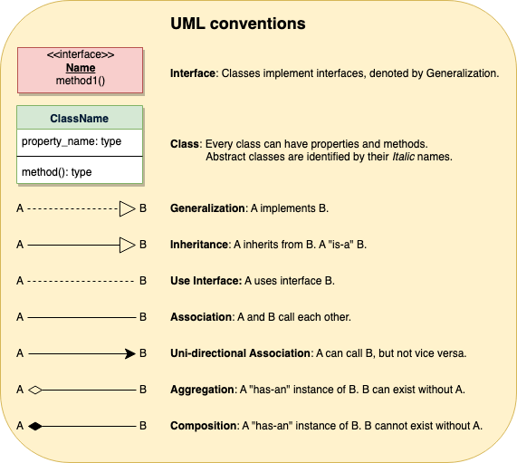

# LLD for Interview

> TO MAIN PAGE - [ Back to main page ](../../README.md)

## Table of Contents

- [Interview Preparation](#interview-preparation)
    - [How to Approach LLD Interview](#how-to-approach-lld-interview)
    - [LLD Asked Questions](#lld-asked-questions)
    - [LLD Questions to Try](#lld-question-to-try)
- [Core Concepts](#basics)
    - [Class & Object Basics](#basics)
    - [UML Diagrams](#uml)
- [Design Principles & Patterns](#design-patterns)
    - [SOLID Principles](#solid-principles)
    - [Design Patterns Overview](#design-patterns)
    - [Pattern Categories](#summary)
        - [Creational Patterns](#summary)
        - [Structural Patterns](#summary)
        - [Behavioral Patterns](#summary)

## How to approach LLD Interview

[ How to approach LLD Interview](3_LLD_how_to_approach_interview.md)

## LLD Asked Questions

[ LLD Asked Questions](../../asked_in_interview_LLD_and_HLD)

## LLD question to try

[ LLD question to try](4_LLD_questions_to_try.md)

## Basics

- **Class** : blueprint for creating objects.
- **Object** : instance of a class.
- **Interface** :  contract for classes to follow.
    - Defines a contract that implementing classes must follow.
    - Cannot have instance variables (only public static final constants).
    - All methods are implicitly public and abstract (unless they have a default or static implementation).
    - Supports multiple inheritance, unlike classes

## UML

## SOLID Principles

[ SOLID Principles](1_SOLID_Principles_CheatSheet.md)

## Design Patterns

### [ Design patterns ](2_Design_Pattern.md)

### summary

| Creational         | Structural    | Behavioral                  |
|:-------------------|:--------------|:----------------------------|
| **Singleton**      | **Adapter**   | **Strategy**                |
| **Factory Method** | **Decorator** | **Observer**                |
| Abstract Factory   | Proxy         | Command                     |
| **Builder**        | **Facade**    | State                       |
| Prototype          | Composite     | Template Method             |
|                    | Flyweight     | **Chain of Responsibility** |

--------------------------------------------------------------------
> TO MAIN PAGE - [ Back to main page ](../../README.md)
