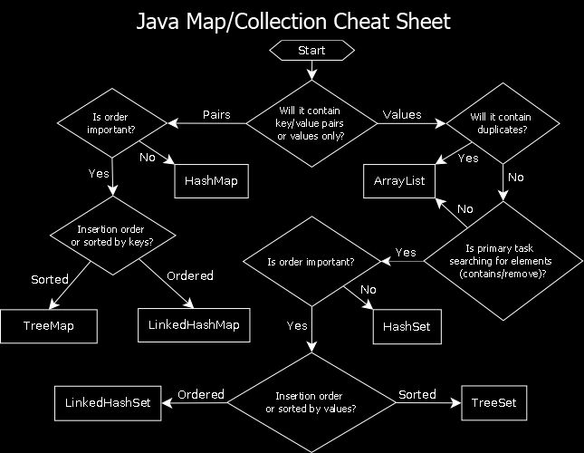
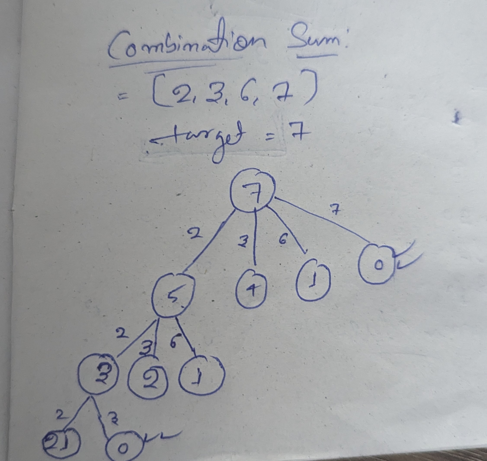

# Table of Contents

- [How to approach a problem](#how-to-approach-a-problem)
- [Warnings section](#warnings-section)
- [Handling Different Types with Deep Copy Examples](#handling-different-types-with-deep-copy-examples)
  - [1D Array to 2D Array](#1-1d-array-to-2d-array)
  - [Primitive Arrays](#2-primitive-arrays)
  - [List of Strings](#3-list-of-strings)
  - [Maps](#4-maps)
  - [Nested Objects](#5-nested-objects)
  - [Collections](#6-collections)
  - [Serialization for Deep Copy](#7-serialization-for-deep-copy)
- [Hints/Tips](#hints-tips)
- [Coding patterns](#coding-patterns)
  - [Two pointer approach](#1-two-pointer-approach)
  - [Sliding window](#2sliding-window)
  - [Merge interval](#2merge-interval)
- [Stack](#stack)
- [Tree](#tree)
- [Approach To Solve](#approach-to-solve)

# How to approach a problem :

1. restate the problem : both are on the same page
2. clarify for constrains and edge cases
3. brute force solution
4. Discuss multiple possible solution
5. Discuss the best solution
6. Write the code

# Warnings section

1. Don't do shallow copy : next iteration will affect the review result
2. unvisit the nodes while reverting back if required.
    - ex : word search if didnot find . while going back unvisit that node , so if other path can use that path.

## Handling Different Types with Deep Copy Examples

### 1. **1D Array to 2D Array**

- **Problem**: If you save a 1D array to a 2D array without deep copying, changes to the 1D array will reflect in the 2D
  array.
- **Solution**:

```java
List<List<Integer>> matrix = new ArrayList<>();
List<Integer> currentRow = new ArrayList<>();
matrix.

add(new ArrayList<>(currentRow)); // Add a DEEP COPY of currentRow
```

### 2. **Primitive Arrays**

- **Problem**: Adding a primitive array directly to a list without cloning will cause changes to the original array to
  reflect in the list.
- **Solution**:

```java
List<int[]> matrix = new ArrayList<>();
int[] currentRow = new int[2]; // Example size

// Iteration 1
currentRow[0]=1;
currentRow[1]=2;
        matrix.

add(currentRow.clone()); // Deep copy
```

### 3. **List of Strings**

- **Problem**: If you add a `List<String>` to another list and modify the original list, the changes will reflect in the
  outer list.
- **Solution**:

```java
List<List<String>> outerList = new ArrayList<>();
List<String> innerList = new ArrayList<>();
innerList.

add("example");
outerList.

add(new ArrayList<>(innerList)); // Deep copy
```

### 4. **Maps**

- **Problem**: Adding a map directly to another map or modifying the original map will affect the copied map.
- **Solution**:

```java
Map<String, String> originalMap = new HashMap<>();
originalMap.

put("key","value");

Map<String, String> deepCopiedMap = new HashMap<>(originalMap); // Deep copy

// For nested maps:
Map<String, Map<String, String>> nestedMap = new HashMap<>();
Map<String, String> innerMap = new HashMap<>();
innerMap.

put("innerKey","innerValue");
nestedMap.

put("outerKey",new HashMap<>(innerMap)); // Deep copy
```

### 5. **Nested Objects**

- **Problem**: If an object contains nested objects, changes to the nested objects will reflect in the original object.
- **Solution**:

```java
class Person {
    String name;
    Address address;

    Person(String name, Address address) {
        this.name = name;
        this.address = new Address(address.city); // Deep copy of Address
    }
}

class Address {
    String city;

    Address(String city) {
        this.city = city;
    }
}

Person original = new Person("John", new Address("New York"));
Person deepCopy = new Person(original.name, original.address);
```

### 6. **Collections**

- **Problem**: Collections like `List`, `Set`, or `Map` containing mutable objects require deep copying to avoid shared
  references.
- **Solution**:

```java
List<Person> originalList = new ArrayList<>();
originalList.

add(new Person("John", new Address("New York")));
List<Person> deepCopiedList = new ArrayList<>();
for(
Person person :originalList){
        deepCopiedList.

add(new Person(person.name, person.address)); // Deep copy
        }
```

### 7. **Serialization for Deep Copy**

- **Problem**: Manual deep copying can be tedious for complex objects.
- **Solution**: Use serialization to create a deep copy.

```java
import java.io.*;

public static Object deepCopy(Object object) throws IOException, ClassNotFoundException {
    ByteArrayOutputStream bos = new ByteArrayOutputStream();
    ObjectOutputStream oos = new ObjectOutputStream(bos);
    oos.writeObject(object);
    ByteArrayInputStream bis = new ByteArrayInputStream(bos.toByteArray());
    ObjectInputStream ois = new ObjectInputStream(bis);
    return ois.readObject();
}
```

### Summary

- Always use deep copy when working with nested or mutable objects to avoid unintended side effects.
- Use appropriate methods like `clone()`, constructors, or serialization based on the complexity of the object.

# Hints/ Tips

- 1. accessing each value of string
    ```java
    string.chatAt(i)
    char[] wrd = word.toCharArray();
    ```
- 2.  pick element and dont pick element tree problem  : use binary tree with taken/not taken

- 3. recursion pattern


# Coding patterns

## 1. two pointer approach

### 2. Types of Two Pointers

- `Collision`: One array, move from two sides to the middle / towards each other
    - Example: Two Sum problem
- `Forward`: One array, both move forward/the same direction
- `Sliding` Window: Both pointers moving in the same direction at a fixed difference of k
- `Fast/Slow:` One pointer moves faster than the other

### When Do I Use This?

Consider using the two-pointer technique for questions that involve searching for a pair (or more) of items in an array
that meet a certain criteria.
Examples:

- Finding a pair of items that `sum to a given target in an array.`
- Finding a `triplet` of items that sum to 0 in a given array.
- Finding the `maximum amount of water` that can be held between two array items representing wall heights

## 2.Sliding window

## 2.merge interval

### When to Sort by Start Time

1. Overlap Detection: When intervals are sorted by start time, you can easily detect overlaps by comparing the current
   interval's start time with the previous interval's end time.
2. Merging: If two intervals overlap, you can merge them by updating the end time of the previous interval to the
   maximum of the two end times.

### When to Sort by End Time

1. Non-Overlapping Intervals: If you need to find the maximum number of non-overlapping intervals (e.g., scheduling
   problems), sorting by end time ensures you pick the interval that finishes earliest, leaving room for more intervals.
2. remove overlapping intervals
3. Greedy Algorithms: In problems like the "Activity Selection Problem," sorting by end time helps in selecting the
   `maximum number of non-overlapping activities`.

- converting arraylist to array

```java
        List<int[]> mergedInterval3 = new ArrayList<>();
        return mergedInterval.

toArray(new int[mergedInterval.size()][]);

```

- merge intervals :

```java
 //merge all overlapping intervals and insert
        while(i<length &&intervals[i][0] <newInterval[1]){
newInterval[0]=Math.

min(newInterval[0], intervals[i][0]);

newInterval[1]=Math.

max(newInterval[1], intervals[i][1]);

i++;
        }
```

## Stack

        Character.isDigit(c)

## Tree

1. sum of all notes in tree

```java
    static int sum(TreeNode node) {
    if (node == null)
        return 0;
    return node.val + sum(node.left) + sum(node.right);
}
```

2. while doing DFS things we can pass as arguments

 ```java
 dfs(currentNode, sum, currentpath, resultSet);
```

3. Buttom up approach

- adding thing while going into tree depth

4. Top down approach :

- adding thing while return from tree ()

---

# Approach To Solve

- Given a problem here are some questions that should help you figure out the general direction of how to solve it

1. Which data structure can I use? Arrays, LinkedList, HashMap, Heap, Tree, or Trie
2. Do I need to use 2 data structures? eg: LRU
3. How do I break the problem into smaller units, is there a problem within a problem, can i write a decision tree?
4. Does this problem look similar to other problems you have solved?
5. Will sorting make the problem easier to solve?
6. Can I use any algorithmic techniques, like bfs, dfs, two pointer etc.
7. Do any design patterns apply that could make it easier to maintain, like observer pattern?
8. What is the time & space complexity? Best case, worst case time complexity? Average case is usually difficult to
   derive.

## 2.Binary Search Algorithm
